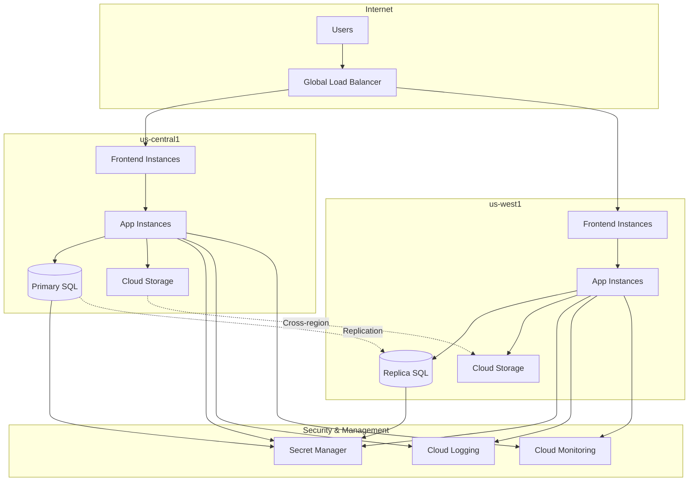
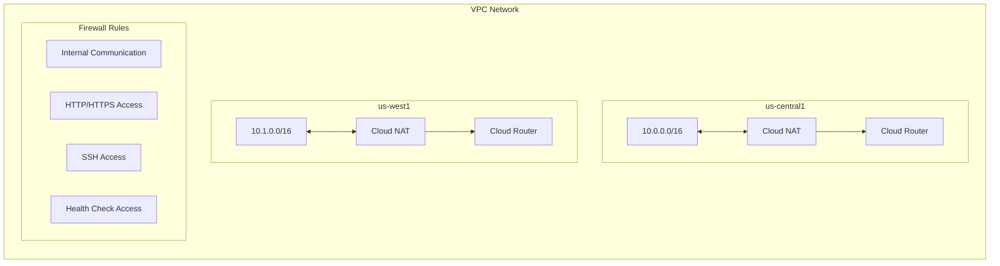

# 🚀 GCP Multi-Region Application Infrastructure

[](LICENSE)
[](https://www.terraform.io/)
[](https://cloud.google.com/)

A highly available, scalable, multi-region application infrastructure deployed on Google Cloud Platform using Terraform. This solution provides enterprise-grade resilience, security, and performance optimization across multiple cloud regions.

## 📋 Table of Contents

- [Architecture Overview](#-architecture-overview)
- [Components](#-components)
- [Architecture Diagrams](#-architecture-diagrams)
- [Features](#-features)
- [Prerequisites](#-prerequisites)
- [Quick Start](#-quick-start)
- [Module Structure](#-module-structure)
- [Configuration](#-configuration)
- [Deployment](#-deployment)
- [Environment Management](#-environment-management)
- [Security](#-security)
- [Monitoring](#-monitoring)
- [Best Practices](#-best-practices)
- [Troubleshooting](#-troubleshooting)
- [Contributing](#-contributing)
- [License](#-license)

## 🏗️ Architecture Overview

This Terraform module deploys a robust multi-region application architecture on Google Cloud Platform, designed for high availability, scalability, and disaster recovery. The architecture spans multiple GCP regions with automatic failover capabilities.


### Core Design Principles

- **High Availability**: Multi-region deployment with automatic failover
- **Scalability**: Auto-scaling instance groups and load balancing
- **Security**: Network isolation, encrypted communications, and secure secret management
- **Observability**: Comprehensive logging, monitoring, and alerting
- **Infrastructure as Code**: Fully automated deployment and management

## 🔧 Components

### 1. Networking Infrastructure
- **VPC Network**: Custom regional VPC with isolated subnets
- **Cloud NAT**: Outbound internet access for private instances
- **Cloud Router**: Regional routing for NAT functionality
- **Firewall Rules**: Secure network access controls

### 2. Compute Infrastructure
- **Instance Groups**: Auto-scaling web and application servers
- **Instance Templates**: Standardized VM configurations
- **Auto-scalers**: Dynamic scaling based on metrics
- **Health Checks**: Application-level health monitoring

### 3. Load Balancing
- **Global HTTP(S) Load Balancer**: Multi-region traffic distribution
- **Backend Services**: Instance group integration
- **Cloud CDN**: Content delivery optimization
- **SSL Certificates**: Automatic SSL/TLS management

### 4. Database Services
- **Cloud SQL**: Regional PostgreSQL instances
- **Read Replicas**: Cross-region data replication
- **Automated Backups**: Point-in-time recovery capability
- **Private IP**: Database connectivity via VPC

### 5. Storage
- **Cloud Storage**: Multi-class storage buckets
- **Versioning**: Data protection and recovery
- **Lifecycle Management**: Automated data archival
- **Access Controls**: IAM-based permissions

### 6. Security & Secrets
- **Secret Manager**: Secure credential storage
- **IAM**: Fine-grained access controls
- **Service Accounts**: Application identity management
- **Network Security**: Private endpoints and firewall rules

## 📊 Architecture Diagrams



### Network Architecture



## ✨ Features

### Multi-Environment Support
- **Development**: Single region, reduced resources
- **Staging**: Multi-region with limited redundancy
- **Production**: Full multi-region with high availability

### Auto-Scaling Capabilities
- CPU utilization-based scaling
- Network traffic-based scaling
- Custom metric integration support
- Auto-healing for unhealthy instances

### Security Features
- VPC isolation with private endpoints
- Encrypted data at rest and in transit
- IAM-based access controls
- Automated secret rotation
- Network security with Cloud Armor

### Observability
- Cloud Logging integration
- Cloud Monitoring dashboards
- Custom alerting policies
- Distributed tracing support
- Performance insights

## 📋 Prerequisites

- **Terraform**: v1.4.0 or higher
- **Google Cloud SDK**: Latest version
- **GCP Project**: With billing enabled
- **Service Account**: With appropriate permissions
- **Domain Name**: For SSL certificate (production environments)

### Required GCP APIs
```bash
gcloud services enable compute.googleapis.com
gcloud services enable iam.googleapis.com
gcloud services enable cloudresourcemanager.googleapis.com
gcloud services enable dns.googleapis.com
gcloud services enable sqladmin.googleapis.com
gcloud services enable storage-api.googleapis.com
gcloud services enable secretmanager.googleapis.com
```

## 🚀 Quick Start

1. **Clone the Repository**
   ```bash
   git clone https://github.com/your-org/gcp-multi-region-app.git
   cd gcp-multi-region-app
   ```

2. **Configure Backend**
   ```bash
   # Create a GCS bucket for Terraform state
   gsutil mb gs://your-terraform-state-bucket
   ```

3. **Initialize Terraform**
   ```bash
   cd environments/dev
   terraform init
   ```

4. **Plan Deployment**
   ```bash
   terraform plan -var-file="terraform.tfvars"
   ```

5. **Apply Configuration**
   ```bash
   terraform apply -var-file="terraform.tfvars"
   ```

## 📁 Module Structure

```
gcp-multi-region-app/
├── environments/              # Environment-specific configurations
│   ├── dev/
│   ├── staging/
│   └── prod/
├── modules/                   # Reusable Terraform modules
│   ├── networking/
│   ├── compute/
│   ├── load-balancer/
│   ├── database/
│   ├── storage/
│   └── dns/
├── docs/                      # Additional documentation
├── scripts/                   # Utility scripts
├── .gitignore
├── LICENSE
├── README.md
├── main.tf
├── variables.tf
├── outputs.tf
└── providers.tf
```

## ⚙️ Configuration

### Environment Variables

Create a `terraform.tfvars` file for each environment:

```hcl
# terraform.tfvars
project_id = "your-gcp-project-id"
environment = "dev"
regions = ["us-central1", "us-west1"]

# Instance configuration
instance_group_configs = {
  "web" = {
    machine_type    = "e2-standard-2"
    instances_count = 2
    disk_size       = 20
    disk_type       = "pd-standard"
    image_family    = "ubuntu-2004-lts"
    image_project   = "ubuntu-os-cloud"
  }
  "app" = {
    machine_type    = "e2-standard-4"
    instances_count = 2
    disk_size       = 50
    disk_type       = "pd-ssd"
    image_family    = "ubuntu-2004-lts"
    image_project   = "ubuntu-os-cloud"
  }
}

# DNS configuration
domain_name = "your-domain.com"
```

### Custom Labels

All resources support custom labeling:

```hcl
labels = {
  terraform    = "true"
  environment  = "prod"
  team         = "platform"
  cost-center  = "infrastructure"
}
```

## 🚀 Deployment

### Development Environment

```bash
cd environments/dev
terraform init
terraform plan -var-file="terraform.tfvars"
terraform apply -var-file="terraform.tfvars"
```

### Staging Environment

```bash
cd environments/staging
terraform init
terraform plan -var-file="terraform.tfvars"
terraform apply -var-file="terraform.tfvars"
```

### Production Environment

```bash
cd environments/prod
terraform init
terraform plan -var-file="terraform.tfvars"
terraform apply -var-file="terraform.tfvars"
```

## 🔄 Environment Management

### State Management

Each environment maintains separate Terraform state:

```hcl
terraform {
  backend "gcs" {
    bucket = "your-terraform-state-bucket"
    prefix = "environments/prod"
  }
}
```

### Environment Promotion

To promote changes from staging to production:

1. Test in staging environment
2. Review and validate changes
3. Apply to production with appropriate approval

## 🔒 Security

### Network Security

- Private subnets with Cloud NAT
- Restricted firewall rules
- VPC flow logs enabled
- Private Google Access enabled

### Data Security

- Cloud SQL with private IP
- Encrypted storage buckets
- Secret Manager for credentials
- IAM least-privilege access

### Application Security

- Service account per application
- Network policies enforcement
- SSL/TLS termination at load balancer
- Cloud Armor integration ready

## 📊 Monitoring

### Built-in Monitoring

- Cloud Monitoring integration
- Custom dashboards
- Alerting policies
- Health check monitoring

### Log Management

```bash
# View application logs
gcloud logging read "resource.type=gce_instance" --format=json

# Set up log-based metrics
gcloud logging metrics create app-error-rate \
  --filter='severity>=ERROR' \
  --description='Application error rate'
```

## 🏆 Best Practices

### Resource Naming

- Use consistent naming conventions
- Include environment in resource names
- Use hyphens for multi-word names

### State Management

- Use separate state files per environment
- Enable versioning on state buckets
- Implement state locking

### Security

- Never commit secrets to version control
- Use IAM roles instead of keys when possible
- Regularly rotate credentials

### Cost Optimization

- Use auto-scaling to match demand
- Implement lifecycle policies for storage
- Right-size instances for workload

## 🔧 Troubleshooting

### Common Issues

1. **State Lock Issues**
   ```bash
   terraform force-unlock <LOCK_ID>
   ```

2. **API Quota Errors**
   ```bash
   gcloud compute project-info describe --project=<PROJECT>
   ```

3. **Network Connectivity**
   ```bash
   gcloud compute ssh <INSTANCE> -- -vvv
   ```

### Debugging Commands

```bash
# Check resource status
terraform show

# View detailed logs
export TF_LOG=DEBUG
terraform apply

# Validate configuration
terraform validate
```

## 🤝 Contributing

### Development Workflow

1. Create feature branch
2. Make changes
3. Add tests
4. Submit pull request

### Code Standards

- Use consistent formatting (`terraform fmt`)
- Add comments for complex logic
- Follow Terraform best practices
- Update documentation

## 📄 License

This project is licensed under the Apache License 2.0 - see the [LICENSE](LICENSE) file for details

---

<div align="center">
  <strong>Built with ❤️ by the Platform Team</strong>
</div>
